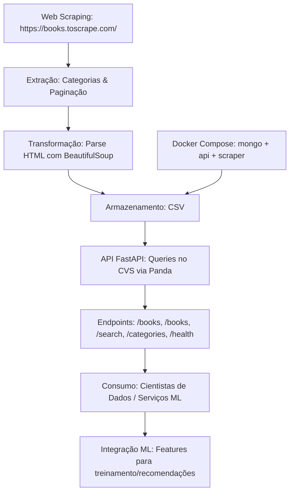

# Tech Challenge Fase 1: API Pública para Consulta de Livros

## Descrição do Projeto

Este projeto é parte do Tech Challenge da Fase 1 da pós-graduação em Machine Learning Engineering. O objetivo é criar uma infraestrutura para extração de dados de livros via web scraping do site https://books.toscrape.com/, armazená-los em um arquivo CSV e e disponibilizá-los por meio de uma API RESTful usando FastAPI. O pipeline é projetado para escalabilidade e integração futura com modelos de machine learning, como sistemas de recomendação.

O projeto inclui:

- Web scraping robusto para capturar título, preço, rating, disponibilidade, categoria e URL da imagem de todos os livros.
- Armazenamento em arquivo CSV para persistência.
- API com endpoints obrigatórios e opcionais, documentada via Swagger.
- Containerização com Docker e orquestração via Docker Compose para facilitar o deploy e a reprodução.
- Pensado para ML: Dados formatados para features e treinamento.

## Arquitetura

**Descrição da Arquitetura:**

- **Pipeline:** Ingestão (scraping) → Processamento (parse e salvar em CSV) → API (serviço RESTful) → Consumo (por apps ou ML pipelines).
- **Cenário de Uso para Cientistas de Dados/ML:** A API serve dados crus ou agregados para treinamento de modelos (ex: embeddings de títulos para recomendação via cosine similarity).
- **Plano de Integração com Modelos de ML:** Futuros endpoints como /ml/features podem retornar dados vetorizados; integre com tools como MLflow para tracking.

## Instruções de Instalação e Configuração

1. Clone o repositório: `git clone https://github.com/fhdumont/tech-challenge-fase1`
2. Entre na pasta: `cd tech-challenge-fase1`
3. Instale Python 3.13+ (baixe em https://www.python.org/downloads/).
4. Crie e ative um ambiente virtual: `python3.13 -m venv env && source env/bin/activate` (ou `env\Scripts\activate` no Windows).
5. Instale as dependências: `pip install -r requirements.txt`
6. Instale Docker para rodar com containers.

Para rodar sem Docker (local):

## Instruções para Execução

## Documentação das Rotas da API

A API usa FastAPI, com documentação automática em `/docs` (Swagger UI).

### Endpoints Obrigatórios

- **GET /api/v1/books**: Lista todos os livros disponíveis.
- **GET /api/v1/books/{id}**: Retorna detalhes de um livro específico pelo ID.
- **GET /api/v1/books/search?title={title}&category={category}**: Busca livros por título e/ou categoria (case-insensitive).
- **GET /api/v1/categories**: Lista todas as categorias únicas.
- **GET /api/v1/health**: Verifica status da API e contagem de livros.

## Deploy

A API está deployada em: https://fiap.fernando.com.br, exemplos de endpoints:

- **https://fiap.fernando.com.br/docs**
- **https://fiap.fernando.com.br/api/v1/books**
- **https://fiap.fernando.com.br/api/v1/categories**
- **https://fiap.fernando.com.br/api/v1/books/top-rated**

## Vídeo de Apresentação

Link do vídeo: https://youtu.be/XXX.
